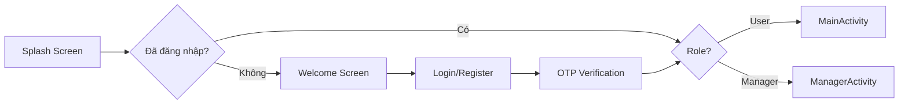
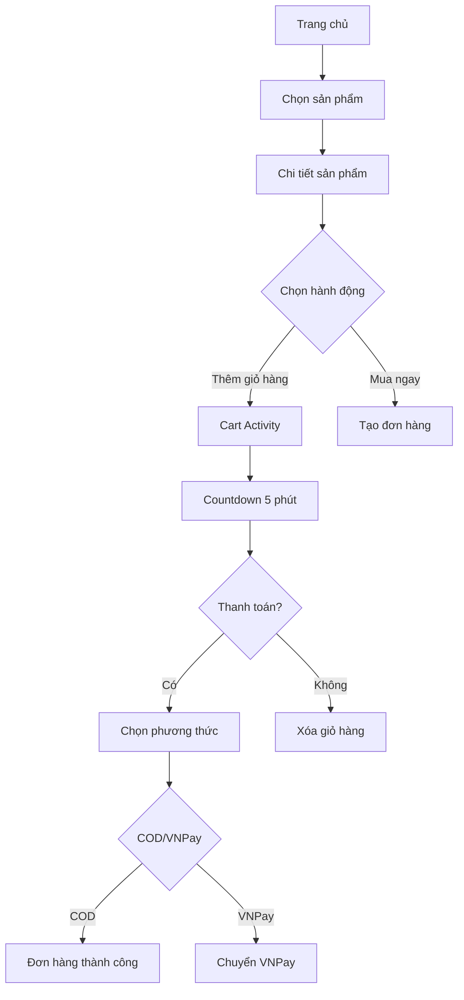
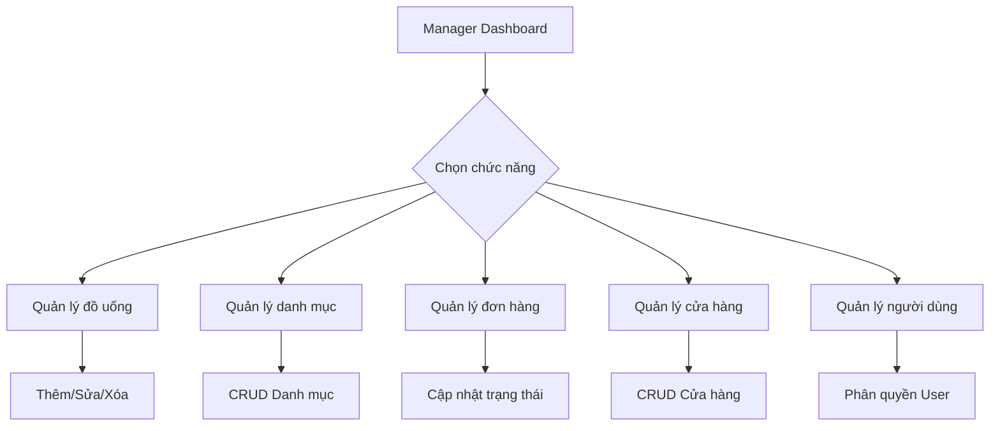

# 🧋 UTEtea - Ứng dụng Đặt Trà Sữa

<div align="center">


**Ứng dụng đặt trà sữa trực tuyến với giao diện hiện đại và trải nghiệm người dùng mượt mà**

[Tính năng](#-tính-năng) • [Cài đặt](#-cài-đặt) • [Kiến trúc](#-kiến-trúc) • [Screenshots](#-screenshots)

</div>

---

## 📱 Giới thiệu

**UTEtea** là ứng dụng Android native được phát triển bằng Kotlin, cho phép người dùng dễ dàng đặt trà sữa trực tuyến với các tính năng:

- 🛒 **Giỏ hàng thông minh** với countdown tự động xóa sau 5 phút
- 🎯 **Tùy chỉnh đồ uống** với size và topping đa dạng
- 💳 **Thanh toán linh hoạt** (COD & VNPay)
- 👨‍💼 **Quản lý toàn diện** cho Manager
- 🔐 **Xác thực OTP** qua email

---

## ✨ Tính năng

### 👤 Dành cho Khách hàng

#### 🏠 Trang chủ & Sản phẩm
- Xem danh sách đồ uống theo danh mục
- Tìm kiếm sản phẩm nhanh chóng
- Xem chi tiết sản phẩm với hình ảnh HD
- Lọc theo danh mục, giá, trạng thái

#### 🛍️ Đặt hàng
- Chọn size (S, M, L) với giá tương ứng
- Thêm topping đa dạng (Trân châu, Thạch, Pudding...)
- Thêm ghi chú cho đơn hàng
- Chọn cửa hàng gần nhất

#### 🛒 Giỏ hàng thông minh
- **Countdown 5 phút** - Giỏ hàng tự động xóa nếu không thanh toán
- Cập nhật số lượng real-time
- Tính tổng tiền tự động
- Xóa sản phẩm dễ dàng

#### 💰 Thanh toán
- **COD** - Thanh toán khi nhận hàng
- **VNPay** - Thanh toán online (đang phát triển)
- Xác nhận đơn hàng ngay lập tức

#### 📦 Quản lý đơn hàng
- Xem lịch sử đơn hàng
- Theo dõi trạng thái đơn hàng
- Chi tiết từng đơn hàng

#### 👤 Tài khoản
- Cập nhật thông tin cá nhân
- Đổi mật khẩu
- Xem điểm thành viên
- Đăng xuất

### 👨‍💼 Dành cho Manager

#### 📊 Dashboard
- Thống kê doanh thu theo ngày/tháng
- Số lượng đơn hàng
- Sản phẩm bán chạy
- Biểu đồ trực quan

#### 🍹 Quản lý đồ uống
- Thêm/Sửa/Xóa đồ uống
- Upload hình ảnh sản phẩm
- Quản lý size và giá
- Quản lý topping
- Bật/Tắt trạng thái sản phẩm

#### 📂 Quản lý danh mục
- Thêm/Sửa/Xóa danh mục
- Sắp xếp danh mục
- Gán sản phẩm vào danh mục

#### 📋 Quản lý đơn hàng
- Xem tất cả đơn hàng
- Cập nhật trạng thái đơn hàng:
  - ⏳ Chờ xử lý
  - 🔄 Đang chuẩn bị
  - 🚚 Đang giao
  - ✅ Hoàn thành
  - ❌ Đã hủy
- Lọc đơn hàng theo trạng thái
- Tìm kiếm đơn hàng

#### 🏪 Quản lý cửa hàng
- Thêm/Sửa/Xóa cửa hàng
- Cập nhật địa chỉ, số điện thoại
- Quản lý giờ mở cửa

#### 👥 Quản lý người dùng
- Xem danh sách người dùng
- Phân quyền (User/Manager)
- Khóa/Mở khóa tài khoản

---

## 🏗️ Kiến trúc

### Tech Stack

```
📱 Frontend
├── Kotlin (100%)
├── Android SDK 24-34
├── Material Design 3
└── ViewBinding

🌐 Networking
├── Retrofit 2
├── OkHttp 3
├── Gson
└── Glide (Image Loading)

🗄️ Local Storage
├── SharedPreferences
└── SessionManager

🎨 UI Components
├── RecyclerView
├── ViewPager2
├── Material Components
└── Custom Views
```

### Cấu trúc thư mục

```
app/src/main/java/com/example/doan/
│
├── 📂 Activities/          # Các màn hình chính
│   ├── MainActivity.kt
│   ├── LoginActivity.kt
│   ├── RegisterActivity.kt
│   ├── CartActivity.kt
│   ├── ProductDetailActivity.kt
│   ├── ManagerActivity.kt
│   └── ...
│
├── 📂 Fragments/           # Các fragment
│   ├── HomeFragment.kt
│   ├── OrderFragment.kt
│   ├── AccountFragment.kt
│   ├── StoreFragment.kt
│   └── Manager/            # Fragment cho Manager
│       ├── DashboardFragment.kt
│       ├── ManageDrinksFragment.kt
│       ├── ManageCategoriesFragment.kt
│       ├── ManageOrdersFragment.kt
│       └── ...
│
├── 📂 Adapters/            # RecyclerView Adapters
│   ├── ProductAdapter.kt
│   ├── CartAdapter.kt
│   ├── OrderAdapter.kt
│   └── ...
│
├── 📂 Models/              # Data classes
│   ├── User.kt
│   ├── Drink.kt
│   ├── Order.kt
│   ├── Cart.kt
│   └── ...
│
├── 📂 Network/             # API & Networking
│   ├── ApiService.kt
│   ├── RetrofitClient.kt
│   └── AuthInterceptor.kt
│
└── 📂 Utils/               # Utilities
    ├── SessionManager.kt
    └── CartManager.kt
```

---

## 🔄 Luồng hoạt động

### 1️⃣ Đăng nhập & Đăng ký



**Chi tiết:**
1. **Splash Screen** (2s) → Kiểm tra session
2. **Welcome Screen** → Chọn Đăng nhập/Đăng ký
3. **Register** → Nhập thông tin → Gửi OTP qua email
4. **OTP Verification** → Xác thực mã OTP
5. **Login** → Nhập username/password → API kiểm tra
6. **Phân quyền** → User → MainActivity | Manager → ManagerActivity

### 2️⃣ Đặt hàng (User Flow)



**Chi tiết:**

#### Bước 1: Chọn sản phẩm
- Xem danh sách sản phẩm theo danh mục
- Tìm kiếm sản phẩm
- Click vào sản phẩm → Chi tiết

#### Bước 2: Tùy chỉnh đơn hàng
```kotlin
// Chọn size
Size: S (0đ) | M (+5,000đ) | L (+10,000đ)

// Chọn topping
☑ Trân châu đen (+5,000đ)
☑ Thạch dừa (+3,000đ)
☐ Pudding (+7,000đ)

// Số lượng
[-] 2 [+]

// Tổng tiền: 45,000đ
```

#### Bước 3: Thêm vào giỏ hàng
- Click "THÊM VÀO GIỎ" → API: `POST /api/cart/add`
- Giỏ hàng bắt đầu **countdown 5 phút**
- Hiển thị thông báo: "⚠️ Giỏ hàng sẽ tự động xóa sau 5 phút"

#### Bước 4: Thanh toán
```kotlin
// Chọn phương thức thanh toán
Dialog {
    💵 Thanh toán khi nhận hàng (COD)
    💳 Thanh toán VNPay
}

// Nếu chọn COD
→ API: POST /api/orders/create
→ Xóa giỏ hàng
→ Hiển thị thông báo thành công
→ Chuyển về trang chủ

// Nếu chọn VNPay
→ Chuyển sang màn hình VNPay (đang phát triển)
```

### 3️⃣ Quản lý (Manager Flow)



**Chi tiết:**

#### Dashboard
```
📊 Thống kê hôm nay
├── 💰 Doanh thu: 2,500,000đ
├── 📦 Đơn hàng: 45
├── 👥 Khách hàng mới: 12
└── 🍹 Sản phẩm bán chạy: Trà sữa trân châu

📈 Biểu đồ doanh thu 7 ngày
```

#### Quản lý đồ uống
```kotlin
// Thêm đồ uống mới
Form {
    Tên: "Trà sữa trân châu"
    Mô tả: "Trà sữa thơm ngon..."
    Giá gốc: 25,000đ
    Danh mục: [Chọn danh mục]
    Hình ảnh: [Upload]
    
    // Size
    ☑ S (0đ)
    ☑ M (+5,000đ)
    ☑ L (+10,000đ)
    
    // Topping
    ☑ Trân châu đen (5,000đ)
    ☑ Thạch dừa (3,000đ)
    
    Trạng thái: ☑ Đang bán
}
```

#### Quản lý đơn hàng
```kotlin
// Danh sách đơn hàng
RecyclerView {
    OrderItem {
        #12345 - Nguyễn Văn A
        Trạng thái: [Dropdown]
        ├── ⏳ Chờ xử lý
        ├── 🔄 Đang chuẩn bị
        ├── 🚚 Đang giao
        ├── ✅ Hoàn thành
        └── ❌ Đã hủy
        
        Tổng tiền: 45,000đ
        [Chi tiết] [Cập nhật]
    }
}
```

---

## 🚀 Cài đặt

### Yêu cầu hệ thống

- **Android Studio**: Arctic Fox trở lên
- **JDK**: 11 trở lên
- **Android SDK**: 24-34
- **Gradle**: 8.0+
- **Kotlin**: 1.9.22

### Bước 1: Clone project

```bash
git clone https://github.com/your-repo/UTEtea.git
cd UTEtea
```

### Bước 2: Cấu hình API

Mở file `RetrofitClient.kt` và cập nhật BASE_URL:

```kotlin
private const val BASE_URL = "http://your-api-url:8080/api/"
```

### Bước 3: Build project

```bash
# Clean project
./gradlew clean

# Build debug APK
./gradlew assembleDebug

# Install to device
./gradlew installDebug
```

### Bước 4: Chạy ứng dụng

1. Mở Android Studio
2. Chọn device/emulator
3. Click **Run** (Shift + F10)

---

## 🔧 Cấu hình

### API Endpoints

File: `Network/ApiService.kt`

```kotlin
interface ApiService {
    // Auth
    @POST("auth/login")
    fun login(@Body request: LoginRequest): Call<ApiResponse<LoginResponse>>
    
    @POST("auth/register")
    fun register(@Body request: RegisterRequest): Call<ApiResponse<RegisterResponse>>
    
    // Drinks
    @GET("drinks")
    fun getDrinks(): Call<ApiResponse<List<Drink>>>
    
    // Cart
    @POST("cart/{userId}/add")
    fun addToCart(@Path("userId") userId: Long, @Body request: AddToCartRequest): Call<ApiResponse<Cart>>
    
    // Orders
    @POST("orders/create")
    fun createOrder(@Body request: CreateOrderRequest): Call<ApiResponse<Order>>
    
    // ... more endpoints
}
```

### Session Management

File: `Utils/SessionManager.kt`

```kotlin
class SessionManager(context: Context) {
    fun saveLoginSession(userId: Int, username: String, fullName: String, ...)
    fun isLoggedIn(): Boolean
    fun isManager(): Boolean
    fun getUserId(): Int
    fun logout()
}
```

---

## 📸 Screenshots

### User Interface

| Trang chủ | Chi tiết sản phẩm | Giỏ hàng |
|-----------|-------------------|----------|
|  |  |  |

| Đơn hàng | Tài khoản | Cửa hàng |
|----------|-----------|----------|
|  |  |  |

### Manager Interface

| Dashboard | Quản lý đồ uống | Quản lý đơn hàng |
|-----------|-----------------|------------------|
|  |  |  |

---

## 🐛 Xử lý lỗi thường gặp

### 1. Lỗi kết nối API

```
❌ Unable to resolve host: No address associated with hostname
```

**Giải pháp:**
- Kiểm tra BASE_URL trong `RetrofitClient.kt`
- Đảm bảo backend đang chạy
- Nếu dùng emulator, dùng `10.0.2.2` thay vì `localhost`

### 2. Lỗi build Gradle

```
❌ Execution failed for task ':app:compileDebugKotlin'
```

**Giải pháp:**
```bash
./gradlew clean
./gradlew build --refresh-dependencies
```

### 3. Lỗi giỏ hàng không cập nhật

**Giải pháp:**
- Kiểm tra `CartAdapter.OnCartChangeListener` đã implement đúng
- Xóa cache app: Settings → Apps → UTEtea → Clear Data

---

## 📝 API Response Format

Tất cả API đều trả về format chuẩn:

```json
{
  "success": true,
  "message": "Success",
  "data": {
    // ... data object
  }
}
```

**Ví dụ:**

```json
// GET /api/drinks
{
  "success": true,
  "message": "Lấy danh sách đồ uống thành công",
  "data": [
    {
      "id": 1,
      "name": "Trà sữa trân châu",
      "description": "Trà sữa thơm ngon với trân châu dai",
      "basePrice": 25000,
      "imageUrl": "/uploads/drinks/tra-sua.jpg",
      "categoryId": 1,
      "categoryName": "Trà sữa",
      "isActive": true,
      "sizes": [
        { "id": 1, "sizeName": "M", "extraPrice": 0 },
        { "id": 2, "sizeName": "L", "extraPrice": 5000 }
      ],
      "toppings": [
        { "id": 1, "toppingName": "Trân châu đen", "price": 5000 }
      ]
    }
  ]
}
```

---

## 🤝 Đóng góp

Mọi đóng góp đều được chào đón! Vui lòng:

1. Fork project
2. Tạo branch mới (`git checkout -b feature/AmazingFeature`)
3. Commit changes (`git commit -m 'Add some AmazingFeature'`)
4. Push to branch (`git push origin feature/AmazingFeature`)
5. Mở Pull Request

---

## 📄 License

Distributed under the MIT License. See `LICENSE` for more information.

---

## 👥 Team

- **Developer**: Your Name
- **Email**: your.email@example.com
- **GitHub**: [@yourusername](https://github.com/yourusername)

---

## 🙏 Acknowledgments

- [Material Design](https://material.io/)
- [Retrofit](https://square.github.io/retrofit/)
- [Glide](https://github.com/bumptech/glide)
- [OkHttp](https://square.github.io/okhttp/)

---

<div align="center">

**Made with ❤️ by UTEtea Team**

⭐ Star this repo if you like it!

</div>
