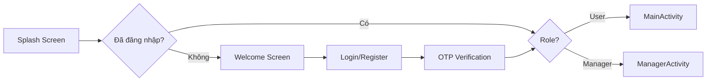
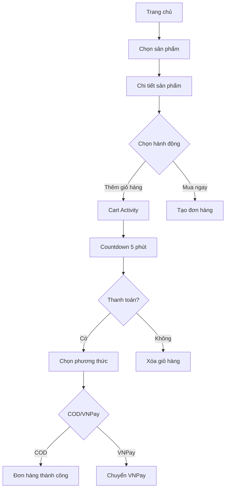
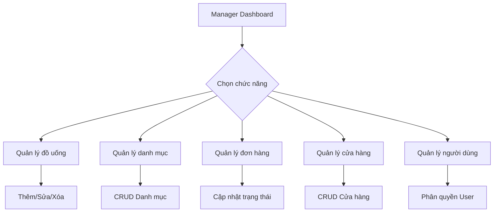

# 🍵 UTE TEA - Ứng dụng đặt trà sữa thông minh

<div align="center">


**Ứng dụng đặt trà sữa với AI, Voice Order, Group Order và nhiều tính năng độc đáo**

[Tính năng](#-tính-năng) • [Cài đặt](#-cài-đặt) • [Kiến trúc](#-kiến-trúc) • [Screenshots](#-screenshots)

</div>

---

## 📱 Giới thiệu

**UTE Tea** là ứng dụng Android native được phát triển bằng Kotlin theo mô hình **MVVM**, mang đến trải nghiệm đặt trà sữa hoàn toàn mới với các tính năng tiên tiến:

### � Điểmc nổi bật

- 🎤 **Voice Order** - Đặt hàng bằng giọng nói với AI Speech Recognition
- � ***AI Predictive Order** - Gợi ý món dựa trên thời tiết và lịch sử
- 👥 **Group Order** - Đặt hàng nhóm với real-time collaboration
- 🎡 **Spin Wheel & Loyalty** - Hệ thống tích điểm 4 tier với vòng quay may mắn
- 💬 **Live Chat** - Hỗ trợ khách hàng real-time
- 🌸 **Seasonal Effects** - Hiệu ứng theo mùa (tuyết rơi, hoa đào, lá vàng)
- 🛡️ **User Monitoring** - Hệ thống giám sát và bảo mật thông minh
- 🔐 **Biometric Login** - Đăng nhập vân tay với mã hóa KeyStore

---

## ✨ Tính năng

### 👤 Dành cho Khách hàng

#### 🏠 Trang chủ thông minh
- **Banner Carousel** với auto-scroll và indicators
- **Best Seller & For You** product carousels
- **Quick Actions**: Voice Order, Chatbot, Spin Wheel, Group Order
- **Smart Suggestion Card** - AI gợi ý món dựa trên thời tiết và lịch sử
- **Weather Integration** - Hiển thị thời tiết real-time
- **Seasonal Effects** - Hiệu ứng theo mùa (tuyết rơi, hoa đào, lá vàng)

#### 🎤 Voice Order System
- **Speech-to-Text** cho đặt hàng bằng giọng nói
- **Natural Language Processing** cho tên món
- **Voice Search** trong menu
- **Real-time Voice Feedback**
- **Microphone Permission Handling**

#### 🔮 AI Predictive Order
- **AI Prediction** dựa trên lịch sử đặt hàng
- **Weather-based Recommendations** 
- **Time-based Suggestions**
- **One-click Add to Cart**
- **Confidence Score Display**

#### 🍽️ Menu & Sản phẩm
- **Grid Layout** hiển thị toàn bộ thực đơn
- **Category Filter** với horizontal scroll
- **Search với Voice Search** support
- **Price Sorting** (ascending/descending)
- **Real-time Search Suggestions**
- **Vietnamese Accent Removal** trong search

#### 🛍️ Đặt hàng & Giỏ hàng
- **Product Detail** với sizes và toppings
- **Real-time Price Calculation**
- **Add to Cart Animation Effects**
- **Review System** với rating summary
- **Smart Cart** với select/unselect items
- **Combined Voucher System** (promotion + spin rewards)
- **Member Tier Discount** calculation

#### 👥 Group Order System
- **Tạo phiên đặt hàng nhóm** với invite code 6 ký tự
- **Real-time Collaboration** với WebSocket
- **Group Chat Integration**
- **Host Controls** (lock/unlock, checkout)
- **Member Management**
- **Collaborative Ordering** với real-time updates

#### 🎡 Loyalty & Spin Wheel
- **4-Tier Membership** (Bronze/Silver/Gold/Diamond)
- **Spin Wheel Animation** với probability system
- **Points Accumulation** và tier benefits
- **Spin Rewards** với voucher codes
- **Auto Tier Upgrade** system

#### 💬 Live Chat Support
- **Real-time Messaging** với WebSocket
- **Smart Queue Management**
- **Auto Response System** cho FAQ
- **Conversation History**
- **Manager Assignment** theo store

#### 💳 Multi-Payment System
- **COD** (Cash on Delivery)
- **VNPay** online payment
- **VietQR** payment
- **OTP Verification** trước khi đặt hàng
- **Payment Status Tracking**

#### 📦 Quản lý đơn hàng
- **Smart Sorting Logic**:
  - Đơn đang xử lý: Sắp xếp theo thời gian đặt (cũ → mới)
  - Đơn hoàn thành: Sắp xếp theo thời gian (mới → cũ)
- **Pagination** với load more
- **Order Statistics** (total, pending, completed)
- **Status-based Filtering**

#### 👤 Profile & Security
- **Biometric Login** (vân tay) với KeyStore encryption
- **Avatar Upload** với image compression
- **Profile Management**
- **Session Management** với encrypted SharedPreferences
- **Auto Token Refresh** mechanism

### 👨‍💼 Dành cho Manager

#### 📊 Dashboard & Analytics
- **Thống kê doanh thu** theo ngày/tháng
- **Order Analytics** với biểu đồ
- **User Behavior Tracking**
- **Popular Items Analysis**
- **Revenue Forecasting**

#### 🍹 Quản lý sản phẩm
- **CRUD Operations** cho đồ uống
- **Image Upload** với Cloudinary
- **Size & Topping Management**
- **Category Assignment**
- **Inventory Management**

#### 📋 Quản lý đơn hàng
- **Real-time Order Updates**
- **Status Management** (PENDING → MAKING → SHIPPING/READY → DONE)
- **Order Filtering** và search
- **Batch Operations**

#### 🎁 Promotion Management
- **Voucher Creation** với business rules
- **Usage Tracking** và analytics
- **Expiry Management**
- **Discount Configuration**

#### 💬 Live Chat Management
- **Conversation Queue**
- **Auto Assignment** theo store
- **Response Templates**
- **Chat Analytics**

### 🛡️ Dành cho Admin

#### 🔍 User Monitoring System
- **Real-time User Behavior Tracking**
- **Risk Score Calculation** algorithm
- **Automated Alert System**
- **Activity Logging** với audit trails
- **IP Blocking Management**
- **Suspicious Activity Detection**

#### 📊 Monitoring Dashboard
- **User Activity Overview**
- **Risk Assessment Reports**
- **Alert Management**
- **System Health Monitoring**
- **Performance Analytics**

#### 🚫 Security Management
- **Rate Limiting Configuration**
- **Blocked IP Management**
- **User Account Controls**
- **Security Incident Response**

---

## 🏗️ Kiến trúc & Công nghệ

### 🎯 MVVM Architecture

Ứng dụng được xây dựng theo mô hình **MVVM** với kiến trúc phân lớp:

```
┌─────────────────────────────────────────┐
│         Activities/Fragments            │  ← UI Layer - Giao diện người dùng
│  (MainActivity, LoginActivity, ...)     │
└─────────────────┬───────────────────────┘
                  │
┌─────────────────▼───────────────────────┐
│         res(layout)                     │  ← XML Layouts - Thiết kế giao diện
│  (activity_main.xml, fragment_home...) │
└─────────────────┬───────────────────────┘
                  │
┌─────────────────▼───────────────────────┐
│         Network Layer                   │  ← API Layer - Kết nối backend
│  (RetrofitClient, ApiService, ...)     │
└─────────────────┬───────────────────────┘
                  │
┌─────────────────▼───────────────────────┐
│         Models                          │  ← Data Layer - Cấu trúc dữ liệu
│  (User, Drink, Order, Cart, ...)       │
└─────────────────┬───────────────────────┘
                  │
┌─────────────────▼───────────────────────┐
│         Adapters                        │  ← RecyclerView - Hiển thị danh sách
│  (ProductAdapter, CartAdapter, ...)    │
└─────────────────────────────────────────┘
```

### 🚀 Tech Stack

#### 📱 Frontend Technologies
```
📱 Core
├── Kotlin (100%) - Modern Android development
├── Android SDK 24-34 - Wide device compatibility
├── Material Design 3 - Modern UI components
├── ViewBinding - Type-safe view references
└── MVVM Architecture - Separation of concerns

🎨 UI/UX
├── RecyclerView - Efficient list display
├── ViewPager2 - Smooth page transitions
├── Material Components - Consistent design
├── Custom Views - Specialized UI elements
├── Lottie Animations - Rich animations
└── Seasonal Effects - Dynamic visual effects

🌐 Networking
├── Retrofit 2 - Type-safe HTTP client
├── OkHttp 3 - HTTP/HTTP2 client
├── Gson - JSON serialization
├── WebSocket - Real-time communication
└── Glide - Image loading & caching

🗄️ Data & Storage
├── SharedPreferences - Simple data storage
├── EncryptedSharedPreferences - Secure storage
├── SessionManager - User session management
├── DataCache - In-memory caching
└── KeyStore - Biometric data encryption

🔒 Security
├── JWT Authentication - Stateless auth
├── Biometric Authentication - Fingerprint login
├── KeyStore Encryption - Secure key storage
├── Certificate Pinning - Network security
└── Input Validation - Data sanitization

🎯 Advanced Features
├── Speech Recognition - Voice commands
├── WebSocket - Real-time updates
├── Push Notifications - OneSignal
├── Location Services - GPS integration
├── Weather API - Weather data
└── AI Predictions - Smart recommendations
```

### 📂 Cấu trúc thư mục chi tiết

```
app/src/main/java/com/example/doan/
│
├── 📂 Activities/                    # Các màn hình chính (45+ files)
│   ├── MainActivity.kt              # Bottom navigation container
│   ├── LoginActivity.kt             # Login với biometric support
│   ├── CartActivity.kt              # Shopping cart với voucher system
│   ├── ProductDetailActivity.kt     # Product detail với reviews
│   ├── UserMonitoringActivity.kt    # Admin monitoring dashboard
│   ├── LiveChatActivity.kt          # Real-time chat interface
│   ├── GroupOrderActivity.kt        # Group ordering system
│   ├── SpinWheelActivity.kt         # Loyalty spin wheel
│   └── ...
│
├── 📂 Fragments/                    # UI Fragments
│   ├── HomeFragment.kt              # Home với AI suggestions
│   ├── MenuFragment.kt              # Menu với voice search
│   ├── OrderFragment.kt             # Order history với smart sorting
│   ├── AccountFragment.kt           # Profile management
│   └── Manager/                     # Manager-specific fragments
│       ├── DashboardFragment.kt     # Analytics dashboard
│       ├── ManageDrinksFragment.kt  # Product management
│       ├── ManageOrdersFragment.kt  # Order management
│       └── ...
│
├── 📂 Adapters/                     # RecyclerView Adapters (50+ files)
│   ├── ProductAdapter.kt            # Product grid display
│   ├── CartAdapter.kt               # Cart items với selection
│   ├── OrderAdapter.kt              # Order history
│   ├── CategoryAdapter.kt           # Category horizontal scroll
│   ├── ProductCarouselAdapter.kt    # Home carousel
│   ├── ChatAdapter.kt               # Live chat messages
│   ├── GroupChatAdapter.kt          # Group order chat
│   ├── NotificationAdapter.kt       # Push notifications
│   ├── MonitoringAlertAdapter.kt    # Admin alerts
│   └── ...
│
├── 📂 Models/                       # Data Classes (100+ files)
│   ├── 👤 User Models/
│   │   ├── User.kt                  # Core user data
│   │   ├── UserProfileDto.kt        # Profile với avatar
│   │   ├── LoginRequest.kt          # Authentication
│   │   └── RegisterRequest.kt       # Registration
│   ├── 🛒 Order Models/
│   │   ├── Order.kt                 # Order với Parcelable
│   │   ├── OrderItem.kt             # Order line items
│   │   ├── CreateOrderRequest.kt    # Order creation
│   │   └── OrderStatus.kt           # Status enum
│   ├── 🥤 Product Models/
│   │   ├── Drink.kt                 # Product với sizes/toppings
│   │   ├── DrinkSize.kt             # Size với extra price
│   │   ├── DrinkTopping.kt          # Topping với price
│   │   └── Category.kt              # Product categories
│   ├── 🎁 Promotion Models/
│   │   ├── Voucher.kt               # Regular vouchers
│   │   ├── SpinRewardDto.kt         # Spin wheel rewards
│   │   └── TierDiscountPreview.kt   # Member tier discounts
│   ├── 👥 Group Order Models/
│   │   ├── GroupOrderDto.kt         # Group order session
│   │   ├── GroupOrderMemberDto.kt   # Session members
│   │   └── GroupChatMessageDto.kt   # Group chat
│   ├── 🛡️ Monitoring Models/
│   │   ├── MonitoringAlert.kt       # System alerts
│   │   ├── UserActivityLog.kt       # Activity tracking
│   │   ├── UserRiskScore.kt         # Risk assessment
│   │   └── MonitoringDashboard.kt   # Admin dashboard
│   └── 🔄 Response Wrappers/
│       ├── ApiResponse.kt           # Standard API wrapper
│       └── PageResponse.kt          # Pagination support
│
├── 📂 Network/                      # API & Networking
│   ├── ApiService.kt                # 100+ API endpoints
│   ├── RetrofitClient.kt            # HTTP client configuration
│   ├── AuthInterceptor.kt           # JWT token management
│   └── WebSocketManagers/           # Real-time communication
│       ├── OrderWebSocketManager.kt # Order updates
│       ├── LiveChatWebSocketManager.kt # Chat messages
│       ├── GroupChatWebSocketManager.kt # Group chat
│       └── MonitoringWebSocketManager.kt # Admin monitoring
│
├── 📂 Utils/                        # Utility Classes
│   ├── 🔒 Security & Session/
│   │   ├── SessionManager.kt        # Encrypted session management
│   │   ├── SecurityChecker.kt       # Security validations
│   │   └── KeyStoreManager.kt       # Biometric encryption
│   ├── 🎨 Animation & Effects/
│   │   ├── AnimationHelper.kt       # Common animations
│   │   ├── SeasonalEffectManager.kt # Seasonal effects
│   │   ├── AddToCartAnimator.kt     # Cart animations
│   │   └── ConfettiView.kt          # Success celebrations
│   ├── 📱 UI Utilities/
│   │   ├── LoadingDialog.kt         # Loading states
│   │   ├── InAppNotification.kt     # Toast alternatives
│   │   ├── HapticFeedbackHelper.kt  # Vibration feedback
│   │   └── DraggableViewHelper.kt   # Drag & drop support
│   ├── 🌐 Network Utilities/
│   │   ├── DataCache.kt             # In-memory caching
│   │   ├── LocationHelper.kt        # GPS location
│   │   └── WeatherHelper.kt         # Weather integration
│   └── 🎯 Specialized Utilities/
│       ├── PredictiveOrderHelper.kt # AI suggestions
│       ├── VoiceOrderHelper.kt      # Voice commands
│       └── CartManager.kt           # Cart state management
│
└── 📂 res/                          # Resources
    ├── 📂 layout/                   # XML Layouts (45+ activity layouts)
    │   ├── activity_main.xml        # Bottom navigation
    │   ├── activity_login.xml       # Login với biometric
    │   ├── activity_cart.xml        # Cart với voucher section
    │   ├── fragment_home.xml        # Home với banners
    │   ├── item_product_card.xml    # Product grid item
    │   ├── item_cart.xml            # Cart item với checkbox
    │   ├── dialog_voice_order.xml   # Voice order interface
    │   └── ...
    ├── 📂 anim/                     # Animations (30+ files)
    │   ├── slide_in_right.xml       # Transition animations
    │   ├── bounce_in.xml            # Button animations
    │   ├── layout_animation_fall_down.xml # List animations
    │   └── pulse_animation.xml      # Loading animations
    ├── 📂 drawable/                 # Graphics (100+ files)
    │   ├── Background gradients và shapes
    │   ├── Status indicators và badges
    │   ├── Seasonal effect backgrounds
    │   └── Icon sets cho features
    ├── 📂 values/
    │   ├── colors.xml               # Wine theme colors
    │   ├── strings.xml              # Localized strings
    │   ├── styles.xml               # Material Design 3
    │   └── dimens.xml               # Responsive dimensions
    └── 📂 values-night/             # Dark theme support
        ├── colors.xml
        └── styles.xml
```

---

## 🚀 Tính năng độc đáo

### 🎤 Voice Order System
**Đặt hàng bằng giọng nói với AI Speech Recognition**

```kotlin
// Voice Order Implementation
class VoiceOrderHelper {
    fun startVoiceRecognition() {
        val intent = Intent(RecognizerIntent.ACTION_RECOGNIZE_SPEECH).apply {
            putExtra(RecognizerIntent.EXTRA_LANGUAGE_MODEL, 
                    RecognizerIntent.LANGUAGE_MODEL_FREE_FORM)
            putExtra(RecognizerIntent.EXTRA_LANGUAGE, "vi-VN")
            putExtra(RecognizerIntent.EXTRA_PROMPT, "Nói tên món bạn muốn đặt...")
        }
        speechRecognizer.startListening(intent)
    }
    
    private fun processVoiceInput(spokenText: String) {
        // Natural Language Processing
        val normalizedText = removeVietnameseAccents(spokenText.lowercase())
        val matchedDrinks = searchDrinksByVoice(normalizedText)
        
        if (matchedDrinks.isNotEmpty()) {
            showVoiceOrderDialog(matchedDrinks.first())
        } else {
            showVoiceSearchSuggestions(normalizedText)
        }
    }
}
```

**Tính năng:**
- Speech-to-text cho đặt hàng
- Natural language processing
- Voice search trong menu
- Real-time voice feedback
- Vietnamese accent handling

### 🔮 AI Predictive Order
**Gợi ý món thông minh dựa trên AI**

```kotlin
// Predictive Order Logic
class PredictiveOrderHelper {
    fun generateSmartSuggestion(user: User): DrinkSuggestion? {
        val orderHistory = getOrderHistory(user)
        val currentWeather = weatherHelper.getCurrentWeather()
        val timeOfDay = getCurrentTimeOfDay()
        
        // Analyze patterns
        val frequentDrinks = analyzeFrequentOrders(orderHistory)
        val weatherPreference = analyzeWeatherPreference(orderHistory, currentWeather)
        val timePreference = analyzeTimePreference(orderHistory, timeOfDay)
        
        // Calculate confidence score
        val suggestion = calculateBestSuggestion(
            frequentDrinks, weatherPreference, timePreference
        )
        
        return if (suggestion.confidenceScore > 0.7) {
            DrinkSuggestion(
                drink = suggestion.drink,
                reason = generateReason(suggestion),
                confidenceScore = suggestion.confidenceScore
            )
        } else null
    }
    
    private fun generateReason(suggestion: Suggestion): String {
        return when {
            suggestion.weatherFactor > 0.5 -> "Phù hợp với thời tiết hôm nay"
            suggestion.timeFactor > 0.5 -> "Thời gian yêu thích của bạn"
            suggestion.historyFactor > 0.5 -> "Món bạn thường đặt"
            else -> "Gợi ý dành cho bạn"
        }
    }
}
```

### 👥 Group Order System
**Đặt hàng nhóm với real-time collaboration**

```kotlin
// Group Order Implementation
class GroupOrderManager {
    fun createGroupOrder(hostUserId: Long): GroupOrderDto {
        val inviteCode = generateInviteCode() // 6-character unique code
        val groupOrder = GroupOrderDto(
            hostUserId = hostUserId,
            inviteCode = inviteCode,
            status = GroupOrderStatus.ACTIVE,
            isLocked = false,
            expiresAt = LocalDateTime.now().plusHours(2)
        )
        
        // Start WebSocket connection for real-time updates
        groupChatWebSocket.connect(groupOrder.id)
        
        return apiService.createGroupOrder(groupOrder)
    }
    
    fun joinGroupOrder(inviteCode: String, userId: Long) {
        val groupOrder = apiService.getGroupOrderByCode(inviteCode)
        
        if (groupOrder.isLocked) {
            throw GroupOrderLockedException("Phiên đã bị khóa")
        }
        
        if (groupOrder.expiresAt.isBefore(LocalDateTime.now())) {
            throw GroupOrderExpiredException("Phiên đã hết hạn")
        }
        
        // Join the session
        apiService.joinGroupOrder(groupOrder.id, userId)
        
        // Connect to group chat
        groupChatWebSocket.joinRoom(groupOrder.id, userId)
    }
}
```

**Workflow:**
1. Host tạo phiên → Generate invite code 6 ký tự
2. Members join bằng code
3. Real-time collaboration với WebSocket
4. Group chat integration
5. Host checkout cho toàn bộ nhóm

### 🎡 Spin Wheel & Loyalty System
**Hệ thống tích điểm 4 tier với vòng quay may mắn**

```kotlin
// Loyalty System Implementation
class LoyaltyManager {
    private val TIER_THRESHOLDS = mapOf(
        MemberTier.BRONZE to 0,
        MemberTier.SILVER to 500,
        MemberTier.GOLD to 2000,
        MemberTier.DIAMOND to 5000
    )
    
    private val TIER_BENEFITS = mapOf(
        MemberTier.BRONZE to TierBenefits(discount = 0.0, spinLimit = 1, pointsMultiplier = 1.0),
        MemberTier.SILVER to TierBenefits(discount = 0.05, spinLimit = 2, pointsMultiplier = 1.2),
        MemberTier.GOLD to TierBenefits(discount = 0.10, spinLimit = 3, pointsMultiplier = 1.5),
        MemberTier.DIAMOND to TierBenefits(discount = 0.15, spinLimit = 5, pointsMultiplier = 2.0)
    )
    
    fun spinWheel(user: User): SpinResult {
        val benefits = TIER_BENEFITS[user.memberTier]!!
        
        // Check spin limit
        if (getSpinCountToday(user) >= benefits.spinLimit) {
            throw SpinLimitExceededException("Đã hết lượt quay hôm nay")
        }
        
        // Spin with probability
        val result = spinWithProbability()
        
        // Save reward
        val reward = createReward(user, result)
        apiService.saveSpinReward(reward)
        
        // Update spin count
        updateSpinCount(user)
        
        return SpinResult(
            rewardType = result.type,
            rewardValue = result.value,
            voucherCode = reward.voucherCode,
            message = result.message
        )
    }
    
    private fun spinWithProbability(): SpinReward {
        val random = Random.nextDouble()
        
        return when {
            random <= 0.02 -> SpinReward.FREE_DRINK
            random <= 0.10 -> SpinReward.FREE_TOPPING
            random <= 0.25 -> SpinReward.VOUCHER_20K
            random <= 0.45 -> SpinReward.VOUCHER_10K
            random <= 0.70 -> SpinReward.POINTS_100
            else -> SpinReward.POINTS_50
        }
    }
}
```

**Member Tiers:**
- **BRONZE**: 0% discount, 1 spin/day, 1x points
- **SILVER**: 5% discount, 2 spins/day, 1.2x points
- **GOLD**: 10% discount, 3 spins/day, 1.5x points
- **DIAMOND**: 15% discount, 5 spins/day, 2x points

### 🌸 Seasonal Effects System
**Hiệu ứng động theo mùa và sự kiện**

```kotlin
// Seasonal Effects Manager
class SeasonalEffectManager {
    fun getCurrentSeasonalEffect(): SeasonalEffect? {
        val currentDate = LocalDate.now()
        val currentMonth = currentDate.monthValue
        
        return when {
            // Tết Nguyên Đán (Tháng 1-2)
            currentMonth in 1..2 -> SeasonalEffect.SAKURA_PETALS
            
            // Valentine (14/2)
            currentDate.monthValue == 2 && currentDate.dayOfMonth == 14 -> 
                SeasonalEffect.FLYING_HEARTS
            
            // Mùa hè (Tháng 6-8)
            currentMonth in 6..8 -> SeasonalEffect.SUNSHINE_BUBBLES
            
            // Mùa thu (Tháng 9-11)
            currentMonth in 9..11 -> SeasonalEffect.FALLING_LEAVES
            
            // Giáng sinh (Tháng 12)
            currentMonth == 12 -> SeasonalEffect.SNOWFALL
            
            else -> null
        }
    }
    
    fun applySeasonalEffect(view: View, effect: SeasonalEffect) {
        when (effect) {
            SeasonalEffect.SNOWFALL -> {
                val snowfallView = SnowfallView(view.context)
                (view as ViewGroup).addView(snowfallView)
                snowfallView.startSnowfall()
            }
            
            SeasonalEffect.SAKURA_PETALS -> {
                val sakuraView = SakuraPetalsView(view.context)
                (view as ViewGroup).addView(sakuraView)
                sakuraView.startPetalsAnimation()
            }
            
            SeasonalEffect.FLYING_HEARTS -> {
                val heartsView = FlyingHeartsView(view.context)
                (view as ViewGroup).addView(heartsView)
                heartsView.startHeartsAnimation()
            }
            
            // ... other effects
        }
    }
}
```

**Available Effects:**
- ❄️ **Winter**: Snowfall animation
- 🌸 **Spring/Tet**: Sakura petals
- ☀️ **Summer**: Sunshine bubbles
- 🍂 **Autumn**: Falling leaves
- 💕 **Valentine**: Flying hearts

### 🛡️ User Monitoring System (Admin)
**Hệ thống giám sát và bảo mật thông minh**

```kotlin
// User Monitoring Implementation
class UserMonitoringManager {
    fun calculateRiskScore(user: User): Int {
        var riskScore = 0
        
        // Failed login attempts (last 24h)
        val failedLogins = getFailedLoginAttempts(user, 24)
        riskScore += failedLogins * 10
        
        // Rate limit violations (last 7 days)
        val rateLimitViolations = getRateLimitViolations(user, 7)
        riskScore += rateLimitViolations * 5
        
        // Suspicious order patterns
        val suspiciousOrders = detectAbnormalOrderPatterns(user)
        riskScore += suspiciousOrders * 20
        
        // Multiple account detection
        if (hasMultipleAccountsFromSameIP(user)) {
            riskScore += 25
        }
        
        // Rapid order cancellations
        val cancellationRate = getOrderCancellationRate(user)
        riskScore += (cancellationRate * 15).toInt()
        
        return minOf(riskScore, 100) // Cap at 100
    }
    
    fun generateAlerts(user: User, riskScore: Int) {
        when {
            riskScore >= 90 -> {
                createAlert(user, AlertType.CRITICAL, "Critical risk score - auto block recommended")
                // Auto block user
                blockUser(user, "Auto-blocked due to critical risk score")
            }
            
            riskScore >= 70 -> {
                createAlert(user, AlertType.HIGH, "High risk score detected")
            }
            
            riskScore >= 50 -> {
                createAlert(user, AlertType.MEDIUM, "Medium risk score - monitor closely")
            }
        }
    }
    
    private fun detectAbnormalOrderPatterns(user: User): Int {
        val orders = getRecentOrders(user, 30) // Last 30 days
        var suspiciousCount = 0
        
        // Check for rapid ordering
        val rapidOrders = orders.groupBy { it.createdAt.toLocalDate() }
            .filter { it.value.size > 10 } // More than 10 orders per day
        suspiciousCount += rapidOrders.size
        
        // Check for unusual order amounts
        val averageOrderValue = orders.map { it.totalPrice }.average()
        val unusualOrders = orders.filter { 
            it.totalPrice > averageOrderValue * 3 || it.totalPrice < averageOrderValue * 0.1 
        }
        suspiciousCount += unusualOrders.size
        
        return suspiciousCount
    }
}
```

**Monitoring Features:**
- **Risk Score Calculation**: Multi-factor algorithm
- **Automated Alerts**: Real-time notifications
- **Activity Logging**: Comprehensive audit trail
- **IP Blocking**: Automatic security measures
- **Pattern Detection**: AI-powered anomaly detection

### 💬 Live Chat Intelligence
**Hệ thống chat thông minh với AI**

```kotlin
// Live Chat System
class LiveChatManager {
    fun startConversation(userId: Long): Conversation {
        // Create conversation
        val conversation = apiService.createConversation(userId)
        
        // Connect WebSocket
        liveChatWebSocket.connect(conversation.id)
        
        // Auto-assign manager
        val manager = assignOptimalManager(conversation)
        if (manager != null) {
            apiService.assignManager(conversation.id, manager.id)
        }
        
        return conversation
    }
    
    private fun assignOptimalManager(conversation: Conversation): Manager? {
        val availableManagers = getAvailableManagers()
        
        // Priority 1: Manager from same store
        val storeManager = availableManagers.find { 
            it.storeId == conversation.user.preferredStoreId 
        }
        if (storeManager != null) return storeManager
        
        // Priority 2: Manager with least active conversations
        return availableManagers.minByOrNull { it.activeConversationCount }
    }
    
    fun processMessage(message: String, conversationId: Long): ChatResponse {
        // Try auto-response first
        val autoResponse = chatbotService.getAutoResponse(message)
        if (autoResponse != null) {
            return ChatResponse(
                message = autoResponse,
                isAutoResponse = true,
                responseTime = 0
            )
        }
        
        // Forward to human manager
        return forwardToManager(message, conversationId)
    }
}

// Chatbot Auto-Response
class ChatbotService {
    private val FAQ_RESPONSES = mapOf(
        listOf("giờ mở cửa", "mở cửa", "đóng cửa") to 
            "🕐 Cửa hàng mở cửa từ 7:00 - 22:00 hàng ngày",
        
        listOf("địa chỉ", "ở đâu", "cửa hàng") to 
            "📍 Địa chỉ cửa hàng:\n• UTE Campus: Số 1 Võ Văn Ngân, Thủ Đức\n• UTE Campus 2: Số 371 Nguyễn Kiệm, Gò Vấp",
        
        listOf("thanh toán", "payment", "trả tiền") to 
            "💳 Hỗ trợ thanh toán:\n• Tiền mặt (COD)\n• VNPay\n• VietQR"
    )
    
    fun getAutoResponse(message: String): String? {
        val normalizedMessage = message.lowercase().trim()
        
        return FAQ_RESPONSES.entries.find { (keywords, _) ->
            keywords.any { keyword -> normalizedMessage.contains(keyword) }
        }?.value
    }
}
```

---

## 🔧 Performance Optimizations

### 🚀 Memory Management
```kotlin
// Fragment Caching in MainActivity
class MainActivity : AppCompatActivity() {
    private val fragmentCache = mutableMapOf<String, Fragment>()
    
    private fun getOrCreateFragment(tag: String): Fragment {
        return fragmentCache.getOrPut(tag) {
            when (tag) {
                "home" -> HomeFragment()
                "menu" -> MenuFragment()
                "order" -> OrderFragment()
                "account" -> AccountFragment()
                else -> throw IllegalArgumentException("Unknown fragment: $tag")
            }
        }
    }
}

// Image Loading Optimization with Glide
class ImageLoader {
    fun loadProductImage(imageView: ImageView, imageUrl: String) {
        Glide.with(imageView.context)
            .load(imageUrl)
            .placeholder(R.drawable.placeholder_product)
            .error(R.drawable.error_image)
            .diskCacheStrategy(DiskCacheStrategy.ALL)
            .transform(CenterCrop(), RoundedCorners(16))
            .into(imageView)
    }
}
```

### 🌐 Network Optimization
```kotlin
// API Response Caching
class DataCache {
    private val memoryCache = LruCache<String, Any>(50)
    private val cacheExpiry = mutableMapOf<String, Long>()
    
    fun <T> get(key: String, clazz: Class<T>): T? {
        val expiry = cacheExpiry[key] ?: return null
        if (System.currentTimeMillis() > expiry) {
            remove(key)
            return null
        }
        
        return memoryCache.get(key) as? T
    }
    
    fun put(key: String, value: Any, ttlMinutes: Int = 5) {
        memoryCache.put(key, value)
        cacheExpiry[key] = System.currentTimeMillis() + (ttlMinutes * 60 * 1000)
    }
}

// Batch API Calls
class ApiOptimizer {
    fun preloadHomeData() {
        // Batch load all home screen data
        val calls = listOf(
            apiService.getCategories(),
            apiService.getBestSellerDrinks(),
            apiService.getPromotions(),
            apiService.getUserPoints()
        )
        
        // Execute all calls concurrently
        calls.forEach { call ->
            call.enqueue(object : Callback<ApiResponse<Any>> {
                override fun onResponse(call: Call<ApiResponse<Any>>, response: Response<ApiResponse<Any>>) {
                    // Cache responses
                    if (response.isSuccessful) {
                        dataCache.put(call.request().url.toString(), response.body()?.data)
                    }
                }
                override fun onFailure(call: Call<ApiResponse<Any>>, t: Throwable) {
                    // Handle error
                }
            })
        }
    }
}
```

### 🎨 UI Performance
```kotlin
// RecyclerView Optimization
class ProductAdapter : RecyclerView.Adapter<ProductAdapter.ViewHolder>() {
    
    // ViewHolder pattern for efficient view recycling
    class ViewHolder(view: View) : RecyclerView.ViewHolder(view) {
        val imageView: ImageView = view.findViewById(R.id.ivProduct)
        val nameText: TextView = view.findViewById(R.id.tvName)
        val priceText: TextView = view.findViewById(R.id.tvPrice)
        
        fun bind(drink: Drink) {
            nameText.text = drink.name
            priceText.text = formatPrice(drink.basePrice)
            
            // Efficient image loading
            ImageLoader.loadProductImage(imageView, drink.imageUrl)
        }
    }
    
    // DiffUtil for efficient list updates
    class DrinkDiffCallback(
        private val oldList: List<Drink>,
        private val newList: List<Drink>
    ) : DiffUtil.Callback() {
        
        override fun getOldListSize() = oldList.size
        override fun getNewListSize() = newList.size
        
        override fun areItemsTheSame(oldItemPosition: Int, newItemPosition: Int): Boolean {
            return oldList[oldItemPosition].id == newList[newItemPosition].id
        }
        
        override fun areContentsTheSame(oldItemPosition: Int, newItemPosition: Int): Boolean {
            return oldList[oldItemPosition] == newList[newItemPosition]
        }
    }
    
    fun updateDrinks(newDrinks: List<Drink>) {
        val diffCallback = DrinkDiffCallback(drinks, newDrinks)
        val diffResult = DiffUtil.calculateDiff(diffCallback)
        
        drinks.clear()
        drinks.addAll(newDrinks)
        diffResult.dispatchUpdatesTo(this)
    }
}
```

---

## 🔐 Security Features

### 🛡️ Biometric Authentication
```kotlin
// Biometric Login Implementation
class BiometricAuthManager(private val context: Context) {
    
    fun authenticateWithBiometric(
        onSuccess: (String) -> Unit,
        onError: (String) -> Unit
    ) {
        val biometricPrompt = BiometricPrompt(
            context as FragmentActivity,
            ContextCompat.getMainExecutor(context),
            object : BiometricPrompt.AuthenticationCallback() {
                override fun onAuthenticationSucceeded(result: BiometricPrompt.AuthenticationResult) {
                    super.onAuthenticationSucceeded(result)
                    
                    // Decrypt stored token
                    val encryptedToken = getEncryptedToken()
                    val decryptedToken = keyStoreManager.decrypt(encryptedToken)
                    
                    onSuccess(decryptedToken)
                }
                
                override fun onAuthenticationError(errorCode: Int, errString: CharSequence) {
                    super.onAuthenticationError(errorCode, errString)
                    onError(errString.toString())
                }
            }
        )
        
        val promptInfo = BiometricPrompt.PromptInfo.Builder()
            .setTitle("Đăng nhập bằng vân tay")
            .setSubtitle("Sử dụng vân tay để đăng nhập nhanh chóng")
            .setNegativeButtonText("Hủy")
            .build()
        
        biometricPrompt.authenticate(promptInfo)
    }
}

// KeyStore Encryption
class KeyStoreManager {
    private val keyAlias = "UTE_TEA_KEY"
    
    fun encrypt(data: String): String {
        val keyGenerator = KeyGenerator.getInstance(KeyProperties.KEY_ALGORITHM_AES, "AndroidKeyStore")
        val keyGenParameterSpec = KeyGenParameterSpec.Builder(
            keyAlias,
            KeyProperties.PURPOSE_ENCRYPT or KeyProperties.PURPOSE_DECRYPT
        )
            .setBlockModes(KeyProperties.BLOCK_MODE_GCM)
            .setEncryptionPaddings(KeyProperties.ENCRYPTION_PADDING_NONE)
            .setUserAuthenticationRequired(true)
            .setUserAuthenticationValidityDurationSeconds(30)
            .build()
        
        keyGenerator.init(keyGenParameterSpec)
        keyGenerator.generateKey()
        
        val keyStore = KeyStore.getInstance("AndroidKeyStore")
        keyStore.load(null)
        
        val secretKey = keyStore.getKey(keyAlias, null) as SecretKey
        val cipher = Cipher.getInstance("AES/GCM/NoPadding")
        cipher.init(Cipher.ENCRYPT_MODE, secretKey)
        
        val encryptedData = cipher.doFinal(data.toByteArray())
        val iv = cipher.iv
        
        return Base64.encodeToString(iv + encryptedData, Base64.DEFAULT)
    }
    
    fun decrypt(encryptedData: String): String {
        val keyStore = KeyStore.getInstance("AndroidKeyStore")
        keyStore.load(null)
        
        val secretKey = keyStore.getKey(keyAlias, null) as SecretKey
        val cipher = Cipher.getInstance("AES/GCM/NoPadding")
        
        val decodedData = Base64.decode(encryptedData, Base64.DEFAULT)
        val iv = decodedData.sliceArray(0..11)
        val cipherText = decodedData.sliceArray(12 until decodedData.size)
        
        val spec = GCMParameterSpec(128, iv)
        cipher.init(Cipher.DECRYPT_MODE, secretKey, spec)
        
        val decryptedData = cipher.doFinal(cipherText)
        return String(decryptedData)
    }
}
```

### 🔒 Session Security
```kotlin
// Encrypted Session Management
class SessionManager(context: Context) {
    private val encryptedPrefs = EncryptedSharedPreferences.create(
        "secure_prefs",
        MasterKeys.getOrCreate(MasterKeys.AES256_GCM_SPEC),
        context,
        EncryptedSharedPreferences.PrefKeyEncryptionScheme.AES256_SIV,
        EncryptedSharedPreferences.PrefValueEncryptionScheme.AES256_GCM
    )
    
    fun saveLoginSession(token: String, userId: Long, userRole: String) {
        encryptedPrefs.edit()
            .putString(KEY_TOKEN, token)
            .putLong(KEY_USER_ID, userId)
            .putString(KEY_USER_ROLE, userRole)
            .putLong(KEY_LOGIN_TIME, System.currentTimeMillis())
            .apply()
    }
    
    fun isSessionValid(): Boolean {
        val loginTime = encryptedPrefs.getLong(KEY_LOGIN_TIME, 0)
        val currentTime = System.currentTimeMillis()
        val sessionDuration = currentTime - loginTime
        
        // Session expires after 24 hours
        return sessionDuration < 24 * 60 * 60 * 1000
    }
    
    fun clearSession() {
        encryptedPrefs.edit().clear().apply()
    }
}
```

---

## 🔄 Luồng hoạt động

### 1️⃣ Đăng nhập & Đăng ký


```mermaid
graph LR
    A[Splash Screen] --> B{Đã đăng nhập?}
    B -->|Có| C{Role?}
    B -->|Không| D[Welcome Screen]
    D --> E[Login/Register]
    E --> F[OTP Verification]
    F --> C
    C -->|User| G[MainActivity]
    C -->|Manager| H[ManagerActivity]
```

**Chi tiết:**
1. **Splash Screen** (2s) → Kiểm tra session
2. **Welcome Screen** → Chọn Đăng nhập/Đăng ký
3. **Register** → Nhập thông tin → Gửi OTP qua email
4. **OTP Verification** → Xác thực mã OTP
5. **Login** → Nhập username/password → API kiểm tra
6. **Phân quyền** → User → MainActivity | Manager → ManagerActivity

### 2️⃣ Đặt hàng (User Flow)


```mermaid
graph TD
    A[Trang chủ] --> B[Chọn sản phẩm]
    B --> C[Chi tiết sản phẩm]
    C --> D{Chọn hành động}
    D -->|Thêm giỏ hàng| E[Cart Activity]
    D -->|Mua ngay| F[Tạo đơn hàng]
    E --> G[Countdown 5 phút]
    G --> H{Thanh toán?}
    H -->|Có| I[Chọn phương thức]
    H -->|Không| J[Xóa giỏ hàng]
    I --> K{COD/VNPay}
    K -->|COD| L[Đơn hàng thành công]
    K -->|VNPay| M[Chuyển VNPay]
```

**Chi tiết:**

#### Bước 1: Chọn sản phẩm
- Xem danh sách sản phẩm theo danh mục
- Tìm kiếm sản phẩm
- Click vào sản phẩm → Chi tiết

#### Bước 2: Tùy chỉnh đơn hàng
```kotlin
// Chọn size
Size: S (0đ) | M (+5,000đ) | L (+10,000đ)

// Chọn topping
☑ Trân châu đen (+5,000đ)
☑ Thạch dừa (+3,000đ)
☐ Pudding (+7,000đ)

// Số lượng
[-] 2 [+]

// Tổng tiền: 45,000đ
```

#### Bước 3: Thêm vào giỏ hàng
- Click "THÊM VÀO GIỎ" → API: `POST /api/cart/add`
- Giỏ hàng bắt đầu **countdown 5 phút**
- Hiển thị thông báo: "⚠️ Giỏ hàng sẽ tự động xóa sau 5 phút"

#### Bước 4: Thanh toán
```kotlin
// Chọn phương thức thanh toán
Dialog {
    💵 Thanh toán khi nhận hàng (COD)
    💳 Thanh toán VNPay
}

// Nếu chọn COD
→ API: POST /api/orders/create
→ Xóa giỏ hàng
→ Hiển thị thông báo thành công
→ Chuyển về trang chủ

// Nếu chọn VNPay
→ Chuyển sang màn hình VNPay (đang phát triển)
```

### 3️⃣ Quản lý (Manager Flow)


```mermaid
graph TD
    A[Manager Dashboard] --> B{Chọn chức năng}
    B --> C[Quản lý đồ uống]
    B --> D[Quản lý danh mục]
    B --> E[Quản lý đơn hàng]
    B --> F[Quản lý cửa hàng]
    B --> G[Quản lý người dùng]
    
    C --> C1[Thêm/Sửa/Xóa]
    D --> D1[CRUD Danh mục]
    E --> E1[Cập nhật trạng thái]
    F --> F1[CRUD Cửa hàng]
    G --> G1[Phân quyền User]
```

**Chi tiết:**

#### Dashboard
```
📊 Thống kê hôm nay
├── 💰 Doanh thu: 2,500,000đ
├── 📦 Đơn hàng: 45
├── 👥 Khách hàng mới: 12
└── 🍹 Sản phẩm bán chạy: Trà sữa trân châu

📈 Biểu đồ doanh thu 7 ngày
```

#### Quản lý đồ uống
```kotlin
// Thêm đồ uống mới
Form {
    Tên: "Trà sữa trân châu"
    Mô tả: "Trà sữa thơm ngon..."
    Giá gốc: 25,000đ
    Danh mục: [Chọn danh mục]
    Hình ảnh: [Upload]
    
    // Size
    ☑ S (0đ)
    ☑ M (+5,000đ)
    ☑ L (+10,000đ)
    
    // Topping
    ☑ Trân châu đen (5,000đ)
    ☑ Thạch dừa (3,000đ)
    
    Trạng thái: ☑ Đang bán
}
```

#### Quản lý đơn hàng
```kotlin
// Danh sách đơn hàng
RecyclerView {
    OrderItem {
        #12345 - Nguyễn Văn A
        Trạng thái: [Dropdown]
        ├── ⏳ Chờ xử lý
        ├── 🔄 Đang chuẩn bị
        ├── 🚚 Đang giao
        ├── ✅ Hoàn thành
        └── ❌ Đã hủy
        
        Tổng tiền: 45,000đ
        [Chi tiết] [Cập nhật]
    }
}
```

---

## 🚀 Cài đặt

### Yêu cầu hệ thống

- **Android Studio**: Arctic Fox trở lên
- **JDK**: 11 trở lên
- **Android SDK**: 24-34
- **Gradle**: 8.0+
- **Kotlin**: 1.9.22

### Bước 1: Clone project

```bash
git clone https://github.com/your-repo/Houjicha.git
cd Houjicha
```

### Bước 2: Cấu hình API

Mở file `RetrofitClient.kt` và cập nhật BASE_URL:

```kotlin
private const val BASE_URL = "http://your-api-url:8080/api/"
```

### Bước 3: Build project

```bash
# Clean project
./gradlew clean

# Build debug APK
./gradlew assembleDebug

# Install to device
./gradlew installDebug
```

### Bước 4: Chạy ứng dụng

1. Mở Android Studio
2. Chọn device/emulator
3. Click **Run** (Shift + F10)

---

## 🔧 Cấu hình

### API Endpoints

File: `Network/ApiService.kt`

```kotlin
interface ApiService {
    // Auth
    @POST("auth/login")
    fun login(@Body request: LoginRequest): Call<ApiResponse<LoginResponse>>
    
    @POST("auth/register")
    fun register(@Body request: RegisterRequest): Call<ApiResponse<RegisterResponse>>
    
    // Drinks
    @GET("drinks")
    fun getDrinks(): Call<ApiResponse<List<Drink>>>
    
    // Cart
    @POST("cart/{userId}/add")
    fun addToCart(@Path("userId") userId: Long, @Body request: AddToCartRequest): Call<ApiResponse<Cart>>
    
    // Orders
    @POST("orders/create")
    fun createOrder(@Body request: CreateOrderRequest): Call<ApiResponse<Order>>
    
    // ... more endpoints
}
```

### Session Management

File: `Utils/SessionManager.kt`

```kotlin
class SessionManager(context: Context) {
    fun saveLoginSession(userId: Int, username: String, fullName: String, ...)
    fun isLoggedIn(): Boolean
    fun isManager(): Boolean
    fun getUserId(): Int
    fun logout()
}
```

---

## 📸 Screenshots

### User Interface

| Trang chủ | Chi tiết sản phẩm | Giỏ hàng |
|-----------|-------------------|----------|
|  |  |  |

| Đơn hàng | Tài khoản | Cửa hàng |
|----------|-----------|----------|
|  |  |  |

### Manager Interface

| Dashboard | Quản lý đồ uống | Quản lý đơn hàng |
|-----------|-----------------|------------------|
|  |  |  |

---

## 🐛 Xử lý lỗi thường gặp

### 1. Lỗi kết nối API

```
❌ Unable to resolve host: No address associated with hostname
```

**Giải pháp:**
- Kiểm tra BASE_URL trong `RetrofitClient.kt`
- Đảm bảo backend đang chạy
- Nếu dùng emulator, dùng `10.0.2.2` thay vì `localhost`

### 2. Lỗi build Gradle

```
❌ Execution failed for task ':app:compileDebugKotlin'
```

**Giải pháp:**
```bash
./gradlew clean
./gradlew build --refresh-dependencies
```

### 3. Lỗi giỏ hàng không cập nhật

**Giải pháp:**
- Kiểm tra `CartAdapter.OnCartChangeListener` đã implement đúng
- Xóa cache app: Settings → Apps → Houjicha → Clear Data

---

## 📝 API Response Format

Tất cả API đều trả về format chuẩn:

```json
{
  "success": true,
  "message": "Success",
  "data": {
    // ... data object
  }
}
```

**Ví dụ:**

```json
// GET /api/drinks
{
  "success": true,
  "message": "Lấy danh sách đồ uống thành công",
  "data": [
    {
      "id": 1,
      "name": "Trà sữa trân châu",
      "description": "Trà sữa thơm ngon với trân châu dai",
      "basePrice": 25000,
      "imageUrl": "/uploads/drinks/tra-sua.jpg",
      "categoryId": 1,
      "categoryName": "Trà sữa",
      "isActive": true,
      "sizes": [
        { "id": 1, "sizeName": "M", "extraPrice": 0 },
        { "id": 2, "sizeName": "L", "extraPrice": 5000 }
      ],
      "toppings": [
        { "id": 1, "toppingName": "Trân châu đen", "price": 5000 }
      ]
    }
  ]
}
```

---

## 🤝 Đóng góp

Mọi đóng góp đều được chào đón! Vui lòng:

1. Fork project
2. Tạo branch mới (`git checkout -b feature/AmazingFeature`)
3. Commit changes (`git commit -m 'Add some AmazingFeature'`)
4. Push to branch (`git push origin feature/AmazingFeature`)
5. Mở Pull Request

---

## 📄 License

Distributed under the MIT License. See `LICENSE` for more information.

---

## 👥 Team

- **Developer**: Your Name
- **Email**: your.email@example.com
- **GitHub**: [@yourusername](https://github.com/yourusername)

---

## 🙏 Acknowledgments

- [Material Design](https://material.io/)
- [Retrofit](https://square.github.io/retrofit/)
- [Glide](https://github.com/bumptech/glide)
- [OkHttp](https://square.github.io/okhttp/)

---

<div align="center">

**Made with ❤️ by Houjicha Team**

⭐ Star this repo if you like it!

</div>
